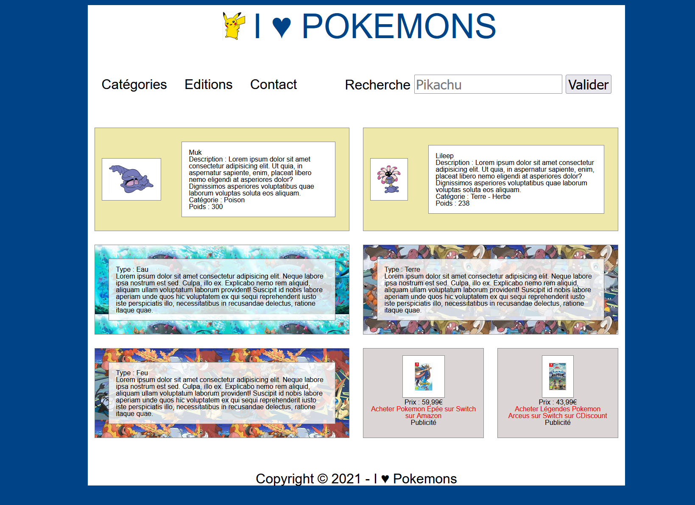

# Grid - Pokemons

Mise en pratique de grid-layout !

## Instructions

- Le HTML est déjà défini, **on n'y touche pas** !!
- Les visuels sont disponibles dans le dossier `images` du projet

- On utilise donc le grid-layout pour mettre chaque bloc à sa place, **sans toucher au HTML**
- On utilise la propriété CSS dédiée à la transparence du background... <code>background: rgb(255,255,255,0.6)</code> où les 3 premiers nombres déterminent la couleur et le 4ème nombre, la transparence.